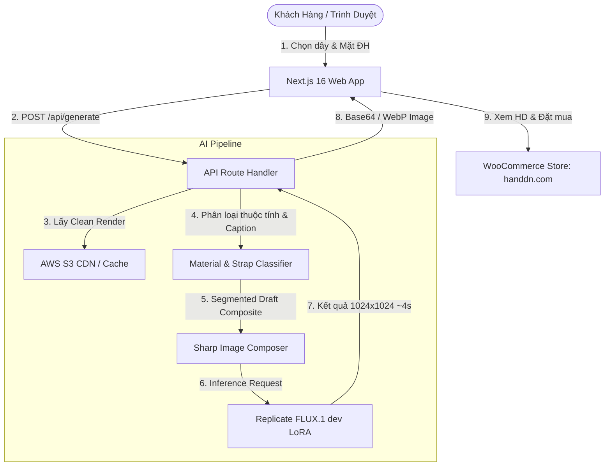

# ⏱️ HANDDN Watch Customizer App

> **Ứng dụng AI phối dây đồng hồ da thủ công cao cấp với mặt đồng hồ trong thời gian thực (~4s)**  
> *Powered by Next.js 16 (Turbopack), FLUX.1 [dev] LoRA (`watch-lora-v2`), MongoDB, AWS S3 CDN & WooCommerce API.*

---

## 🌟 Tổng Quan Dự Án (Project Overview)

**HANDDN Watch Customizer** là giải pháp AI thương mại điện tử giúp khách hàng trực quan hóa sự kết hợp hoàn hảo giữa các mẫu **dây da đồng hồ thủ công HANDDN** (da cá sấu, da đà điểu, da lợn rừng Peccary, da sáp Pueblo, da mông ngựa Shell Cordovan...) và bất kỳ **mặt đồng hồ** nào (chụp từ điện thoại hoặc chọn trong thư viện thương hiệu nổi tiếng như *Rolex, Patek Philippe, A. Lange & Söhne, Omega, Cartier, AP, Akrivia...*).

### ✨ Các Tính Năng Nổi Bật:
* ⚡ **Tốc độ sinh ảnh thần tốc (~3.9s - 5.2s)**: Nhờ mô hình LoRA chuyên biệt được huấn luyện trên GPU H100 kết hợp bộ nhớ đệm Clean Straps trên AWS S3 CDN.
* 💎 **Độ chính xác cao về 28 dòng chất liệu & thuộc tính thực tế**:
  * *Chất liệu*: Vảy ngói & vảy tròn cá sấu (Alligator), Gai sống lưng 3D (Hornback), Sóng nhám cá mập (Shark), Nốt hạt tròn đà điểu (Ostrich), Chùm 3 lỗ chân lông (Peccary), Sáp xước mộc (Pueblo), Kẻ chéo (Saffiano), Sóng lượn (Epi), Bóng gương (Cordovan)...
  * *Thuộc tính*: Nhận diện chuẩn xác dây phẳng (*Flat*), độn vòm mềm (*Domed*), độn gờ vuông (*Square*), độn đôi (*Double Padded*), chỉ vi sợi (*Micro-stitch*), chỉ ngang chốt tai (*Side-stitch*), chỉ đôi, mép gấp (*Folded Edge*), đầu cong ôm vỏ (*Curved End*).
* 🔍 **Trình Phóng Đại 2K (HD Zoom Lightbox)**: Cho phép khách hàng zoom sát vào ảnh kết quả để kiểm tra từng đường kim mũi chỉ và thớ da.
* 🛍️ **Đặt Mua 1 Chạm (One-Click Order Handoff)**: Chuyển thẳng từ kết quả phối đồ sang trang sản phẩm trên `handdn.com` để thanh toán.
* 🛡️ **Production Hardening**: Tích hợp Rate Limiting (12 req/phút/IP), Fast-Fail Env Validation, MongoDB TTL Index auto-expire (30 phút), SSRF Protection và Bearer Auth Sync.

---

## 🏗️ Kiến Trúc Hệ Thống (Architecture)



---

## 🤖 Thông Tin Mô Hình LoRA Đã Huấn Luyện (Model Provenance)

Hệ thống hiện tại đang sử dụng mô hình LoRA **`watch-lora-v2`** phiên bản tối ưu nhất:

* **Replicate Model URL**: [https://replicate.com/tommy0710/watch-lora-v2](https://replicate.com/tommy0710/watch-lora-v2)
* **Active Version**: `tommy0710/watch-lora-v2:92e11109731d8fd4b3f1df002d8253d6d30eaebc4a6e09dedd587f9c64b9e156`
* **File Trọng Số Weights**: [trained_model.tar](https://replicate.delivery/xezq/FY2stSr1Ey7dAh8T568gTdrPleZ0LYYc2RLWIdiPgdLk6WiLA/trained_model.tar)
* **Dataset Đã Huấn Luyện**: 68 cặp ảnh mẫu chất lượng cao đạt chuẩn 8/8 faces.
* **Trigger Word**: `HNDDNW`
* **Prompt Schema**: `material-v2`
* **Cấu hình Inference khuyên dùng**:
  * `prompt_strength`: `0.35`
  * `lora_scale`: `1.0`
  * `num_inference_steps`: `28 - 30`

---

## 🚀 Hướng Dẫn Cài Đặt & Chạy Cục Bộ (Local Setup)

### 1. Yêu Cầu Tiên Quyết (Prerequisites)
* **Node.js**: Phiên bản `v20.x` hoặc `v22.x` (khuyến nghị dùng Node LTS).
* **npm** hoặc **pnpm / yarn**.
* Tài khoản & API Token của **Replicate**, **MongoDB Atlas**, **AWS S3** và **WooCommerce**.

### 2. Cài Đặt Mã Nguồn
```bash
# Clone repository
git clone https://github.com/Tommy0710/watch-customizer-app.git
cd watch-customizer-app

# Cài đặt dependencies
npm install
```

### 3. Cấu Hình File Biến Môi Trường (`.env.local`)
Tạo file `.env.local` ở thư mục gốc (hoặc copy từ `.env.example`):
```bash
cp .env.example .env.local
```

Điền đầy đủ các thông tin:
```ini
# 1. WooCommerce API (Đồng bộ catalog sản phẩm Handdn)
WC_CONSUMER_KEY=ck_your_woocommerce_consumer_key
WC_CONSUMER_SECRET=cs_your_woocommerce_consumer_secret
WC_BAESE64_KEY=

# 2. Database MongoDB
MONGODB_URI=mongodb+srv://<username>:<password>@<cluster>.mongodb.net/watch_customizer?retryWrites=true&w=majority

# 3. Replicate API Token
REPLICATE_API_TOKEN=r8_your_replicate_api_token

# 4. AWS S3 Storage
AWS_REGION=ap-southeast-1
AWS_S3_BUCKET=watch-face-handdn
AWS_S3_FACES_PREFIX=
AWS_ACCESS_KEY_ID=your_aws_access_key_id
AWS_SECRET_ACCESS_KEY=your_aws_secret_access_key

# 5. Cấu hình AI LoRA Engine
GENERATE_ENGINE=lora
REPLICATE_LORA_PROMPT_SCHEMA=material-v2
REPLICATE_LORA_PROMPT_STRENGTH=0.35
REPLICATE_LORA_WEIGHTS=https://replicate.delivery/xezq/FY2stSr1Ey7dAh8T568gTdrPleZ0LYYc2RLWIdiPgdLk6WiLA/trained_model.tar
CLEAN_STRAP_DIR=scripts/dataset/out/straps-clean
```

### 4. Chạy Ứng Dụng
```bash
# Chạy môi trường Development
npm run dev

# Mở trình duyệt truy cập: http://localhost:3000
```

### 5. Chạy Kiểm Thử & Build Production
```bash
# Chạy bộ unit tests (140 tests)
npm test

# Build production bundle (Next.js Turbopack)
npm run build

# Khởi chạy production server
npm start
```

---

## 🛠️ Hướng Dẫn Chi Tiết Về Huấn Luyện & Xử Lý Dữ Liệu LoRA (LoRA Tooling)

Toàn bộ công cụ tạo dữ liệu, kiểm định và huấn luyện đều nằm trong thư mục `scripts/`:

```
scripts/
├── dataset/
│   ├── render-clean-straps.ts  # Tự động tạo ảnh Clean Studio Straps cho toàn bộ catalog
│   ├── upload-clean-straps.ts  # Kiểm định (8/8 faces) và upload lên AWS S3 CDN
│   ├── generate-pairs.ts       # Sinh cặp ảnh mẫu chuẩn từ FLUX PRO cho tập train
│   ├── pack-style-dataset.ts   # Đóng gói dataset thành style-dataset.zip với captions material-v2
│   ├── train-style.ts          # Khởi chạy job huấn luyện LoRA trên Replicate GPU H100
│   └── materialTaxonomy.ts     # Bộ quy tắc phân loại 28 dòng chất liệu
└── lib/
    └── spendGuard.ts           # Bảo vệ giới hạn ngân sách tự động
```

---

### 📖 Quy Trình Huấn Luyện Mô Hình LoRA Mới (Step-by-Step Training Guide):

#### Bước 1: Sinh thêm các cặp ảnh mẫu chất lượng cao (nếu muốn mở rộng dataset)
```bash
# Sinh các cặp ảnh mẫu chuẩn cho tập train với hạn mức ngân sách an toàn
npm run ds scripts/dataset/generate-pairs.ts -- --set=train --max-spend=5.00
```

#### Bước 2: Đóng gói Dataset Chuẩn Hóa (`material-v2`)
```bash
# Đóng gói toàn bộ ảnh và captions định dạng chuẩn vào file style-dataset.zip
npm run ds scripts/dataset/pack-style-dataset.ts
```

#### Bước 3: Khởi chạy Huấn Luyện LoRA trên Replicate (GPU H100)
```bash
# Chạy huấn luyện 1000 steps hoặc 1500 steps
REPLICATE_LORA_PROMPT_SCHEMA=material-v2 ALLOW_PAID_TRAINING=1 npm run ds scripts/dataset/train-style.ts -- --steps=1000 --destination=tommy0710/watch-lora-v2 --confirm-paid
```

Sau khi hoàn thành, Terminal sẽ in ra URL của trọng số mới:
```json
{
  "version": "tommy0710/watch-lora-v2:...",
  "weights": "https://replicate.delivery/xezq/.../trained_model.tar"
}
```

#### Bước 4: Cập nhật trọng số mới vào `.env.local`
Dán URL `weights` vừa nhận được vào biến `REPLICATE_LORA_WEIGHTS` trong `.env.local` và khởi động lại server!

---

### 🧼 Quy Trình Kết Xuất & Đẩy Clean Straps Lên S3 CDN:

1. **Kết xuất ảnh Clean Studio Render cho catalog**:
```bash
npm run ds scripts/dataset/render-clean-straps.ts -- --all --max-spend=5.00
```

2. **Kiểm định chất lượng trên 8 mặt đồng hồ mẫu & đẩy lên S3 CDN**:
```bash
npm run ds scripts/dataset/upload-clean-straps.ts -- --upload
```

---

## 📡 API Endpoints Reference

| Endpoint | Method | Chức Năng | Bảo Mật |
| :--- | :--- | :--- | :--- |
| `/api/generate` | `POST` | Ghép dây và mặt đồng hồ bằng LoRA (~4s) | Rate Limit (12 req/min), SSRF Guard |
| `/api/upload` | `POST` / `GET` | Tải ảnh từ điện thoại qua QR Code | TTL Index (30 mins auto-expire) |
| `/api/faces/image` | `GET` | Lấy ảnh mặt đồng hồ chất lượng cao từ S3 | S3 Presigned / Cache |
| `/api/woocommerce/sync` | `GET` | Đồng bộ toàn bộ sản phẩm từ Handdn WooCommerce | Bearer `SYNC_SECRET` |
| `/api/faces/sync` | `GET` | Đồng bộ danh sách mặt đồng hồ từ S3 vào MongoDB | Bearer `SYNC_SECRET` |

---

## 👨‍💻 Tác Giả & Bản Quyền (License)

* **Phát triển bởi**: Tommy & HANDDN Tech Team.
* **Bản quyền**: © 2026 HANDDN. All rights reserved.
